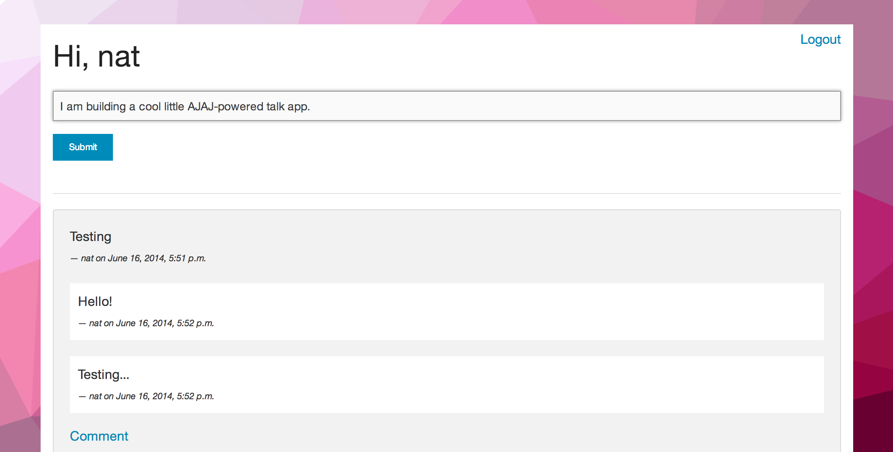

What the AJAJ?! (Part 1)
------------------------

AJAJ (Asynchronous JavaScript and JSON) allows clients and servers to talk in the background. Here is a simple diagram illustrating how this happens in a Django application.

        _____________
       / Browser  UI \
      |  ^v^v^v^v^v^  | (UI updates, no browser refresh)
       \____AJAJ_____/
            |  ^
            |  |        (http)
            v  |
         Django View

Using the jQuery library makes this easy as pie and fun as roller coaster rides. Let's take a look at what we will be building today.

Go [check out](https://github.com/broinjc/talk) the talk repo.

Cookies are delicious!
----------------------

Allow me to digress and mention Cross-Site Request Forgeries. CSRF happens when an attaker steals a victims cookies using another website a victim might have open in their browser. Django defends against this by using CSRF tokens in forms. Since we are handling data asynchronously we will need to handle CSRF issues with javascript. 

Further CSRF reading, http://blog.codinghorror.com/preventing-csrf-and-xsrf-attacks/

Let's build it!
---------------

Before we begin open `urls.py`, `views.py`, and `models.py`. Make sure you have 

  - a `Post` model 

          class Post(models.Model):
            # author = models.ForeignKey(User)
            text = models.TextField()

            # Time is a rhinocerous
            updated = models.DateTimeField(auto_now=True)
            created = models.DateTimeField(auto_now_add=True)

            class Meta:
                ordering = ['created']

            def __unicode__(self):
                # return self.text+' - '+self.author.username
                return self.text

  - Some URLs

           url(r'^$', 'home'),
           url(r'^create_post/$', 'create_post'),
  
  - Some views

          def home(req):

            tmpl_vars = {
                'all_posts': Post.objects.reverse(),
            }

            return render(req, 'talk/index.html', tmpl_vars)

          def create_post(request):
              pass

Also, you will need an index to put your initial page. So create a url, view and template for that as well.

0. Make a little HTML form

            <form id="post-form" onsubmit='return false;' >
                
                <input type="text" id="the_post" required/>
                <input type='submit' id='create_post_btn' class="tiny button" />
            </form>

1. Write javascript that will communicate with a view.

                $('#post-form').on('submit', function(){
                    console.log("form submitted!")  // sanity check
                    create_post();
                });

            function create_post() {
              $.ajax({
                url : "create_post/", // this url should point to our view
                type : "POST",
                data : { the_post : $('#the_post').val() }, // Send JSON
                success : function(json) {
                  $('#the_post').val(''); // Clear the post field
        
                  // Prepend the content to the talk div
                  // make_post() returns html formatted with json.
                  // $("#talk").prepend(make_post(json));
        
                  console.log("got "+json);
                },
                error : function(xhr,errmsg,err) {
                  // Log errors
                  console.log(xhr.status + ": " + xhr.responseText);
                }
              });
            };

2. Write this JSON view that creates a post.

            import json # muy importante
            def create_post(request):
        
                post_text = request.POST.get('the_post')
                response_data = {}
        
                # post = Post(text=post_text, author=request.user)
                post = Post(text=post_text)
                post.save()
        
                response_data['result'] = 'Success!'
                response_data['postpk'] = post.pk
                response_data['text'] = post.text
                response_data['created'] = post.created.strftime('%m/%d %H:%M')
                # response_data['author'] = post.author.username
        
                return HttpResponse(
                    json.dumps(response_data),
                    content_type="application/json"
                )

3. Last but certainly not least is the code you need that will handle CSRF.

            //This function gets cookie with a given name
            function getCookie(name) {
                var cookieValue = null;
                if (document.cookie && document.cookie != '') {
                    var cookies = document.cookie.split(';');
                    for (var i = 0; i < cookies.length; i++) {
                        var cookie = jQuery.trim(cookies[i]);
                        // Does this cookie string begin with the name we want?
                        if (cookie.substring(0, name.length + 1) == (name + '=')) {
                            cookieValue = decodeURIComponent(cookie.substring(name.length + 1));
                            break;
                        }
                    }
                }
                return cookieValue;
            }
            var csrftoken = getCookie('csrftoken');
        
            /*
            The functions below will create a header with csrftoken
            */
        
            function csrfSafeMethod(method) {
                // these HTTP methods do not require CSRF protection
                return (/^(GET|HEAD|OPTIONS|TRACE)$/.test(method));
            }
            function sameOrigin(url) {
                // test that a given url is a same-origin URL
                // url could be relative or scheme relative or absolute
                var host = document.location.host; // host + port
                var protocol = document.location.protocol;
                var sr_origin = '//' + host;
                var origin = protocol + sr_origin;
                // Allow absolute or scheme relative URLs to same origin
                return (url == origin || url.slice(0, origin.length + 1) == origin + '/') ||
                    (url == sr_origin || url.slice(0, sr_origin.length + 1) == sr_origin + '/') ||
                    // or any other URL that isn't scheme relative or absolute i.e relative.
                    !(/^(\/\/|http:|https:).*/.test(url));
            }
        
            $.ajaxSetup({
                beforeSend: function(xhr, settings) {
                    if (!csrfSafeMethod(settings.type) && sameOrigin(settings.url)) {
                        // Send the token to same-origin, relative URLs only.
                        // Send the token only if the method warrants CSRF protection
                        // Using the CSRFToken value acquired earlier
                        xhr.setRequestHeader("X-CSRFToken", csrftoken);
                    }
                }
            });

Happy coding!
